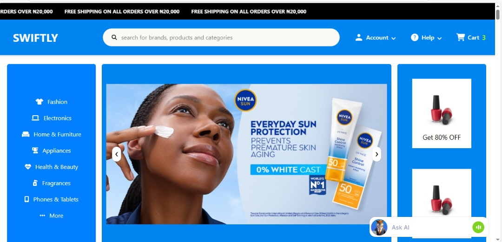
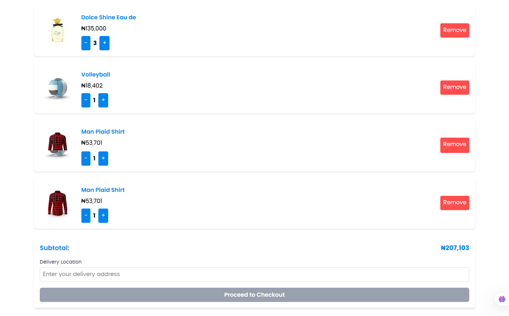
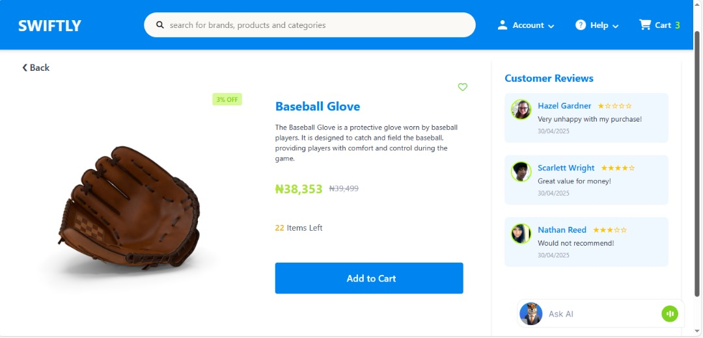

# 🦊 Swiftly — E-commerce Web App (Team Project)

**Swiftly** is a modern, responsive frontend e-commerce interface built collaboratively using **HTML**, **Tailwind CSS**, **CSS**, and **JavaScript**. It features product listing, dynamic cart interactions, login handling, visual animations, and a custom AI Agent for support.

---

## 🚀 Features Implemented

* 🔍 Live Product Search
* 🛒 Dynamic Cart Interactions (add, remove, update quantities)
* 👤 Frontend Login & Sign‑up Flow
* 🤖 AI Agent Chatbot for Customer Support
* 🧠 Modular JavaScript Architecture (Cart, Login, Effects, Agent)
* ⚙️ Loading and Error State Handling
* 🎨 Styled Component Pages (Cart, Product, Login)
* 📱 Fully Responsive Design via Tailwind CSS
* 🎭 Animation Effects for Enhanced UX

---

## 🧠 Technologies Used

| 💻 Technology        | 🔧 Description                                        |
| -------------------- | ----------------------------------------------------- |
| **HTML5**            | Semantic markup and page structure                    |
| **Tailwind CSS**     | Utility‑first CSS framework for rapid styling         |
| **CSS3**             | Component‑specific and global custom styles           |
| **JavaScript (ES6)** | Dynamic behavior, DOM manipulation, application logic |
| **jQuery 3.7.1**     | Simplified DOM operations and AJAX support            |

---

## 🌐 API Used

* **DummyJSON** — Provides dynamic dummy product data for rendering ([dummyjson.com](https://dummyjson.com/))

---

## 🗂️ File Structure & Purpose

```plaintext
.
├── .vscode
│   └── settings.json          # VS Code workspace settings
├── css/
│   ├── animations.css         # Keyframe animations & transitions
│   ├── cart.css               # Styles for Cart page
│   ├── main.css               # Global styles
│   └── style.css              # Styles for Login page
├── images/
│   └── templateImg.png        # Fallback image for missing products
├── js/
│   ├── agent.js               # AI Agent chatbot logic
│   ├── cart.js                # Cart functionality (add/remove, quantity)
│   ├── effects.js             # UI animations and hover effects
│   ├── error.js               # Error handling (empty cart, invalid search)
│   ├── jquery-3.7.1.min.js    # jQuery library
│   ├── login.js               # Login form validation & session storage
│   └── script.js              # Homepage logic & product rendering
├── cart.html                  # Cart page markup
├── index.html                 # Homepage markup
├── login.html                 # Login page markup
├── productpage.html           # Product detail page markup
├── tailwind.config.js         # Tailwind CSS customization
└── README.md                  # Project documentation
```

---

## 👨‍👩‍👧‍👦 Team Contributions

### 🧠 General Site Features

* Product listing & dynamic rendering
* Search filtering & error states
* Cart management & UI updates
* Login flow & session persistence
* AI Agent customer support

---

### 😌 Oluwanifemi

**Files Worked On:**

* `agent.js`
* `effects.js`
* `script.js`
* `index.html`
* `README.md`
* `main.css`
* `animations.css`


## 🤖 AI Agent Features

Our custom AI Assistant helps customers seamlessly navigate the Swiftly store and resolve queries in real time. Key capabilities include:

* **Product Q&A:** Instantly answers detailed questions about product specs, availability, pricing, and variants.  
* **Order Status Tracking:** Retrieves live order updates (processing, shipping, delivery estimates) based on order ID or user session.  
* **Personalized Recommendations:** Suggests related or complementary items based on browsing history and purchase patterns.  
* **Returns & Refunds Assistance:** Guides customers through the return policy, refund timelines, and generates return labels or instructions.  
* **FAQ & Troubleshooting:** Provides automated responses to common questions (payment methods, account setup, coupon codes, etc.).  
* **Cart & Checkout Support:** Helps add/remove items from the cart, applies discount codes, and walks users through the checkout flow.  
* **Upsell & Cross‑sell Prompts:** Proactively recommends add‑ons or upgrades (“Customers who bought this also liked…”).  
* **Multilingual Support:** Detects user language preference (e.g., English, Spanish) and converses accordingly.  
* **Live Handover:** Escalates to a human agent by generating a support ticket or connecting via chat when needed.  
* **Smart Follow‑Up:** Sends proactive reminders—for abandoned carts, out‑of‑stock alerts, or post‑purchase feedback requests.  


**Features Implemented:**

* Designed & implemented the homepage showcasing all products
* Built live search functionality with dynamic results
* Managed API fetch calls and data handling
* Developed product detail page logic
* Trained the AI Agent with Swiftly’s dataset
* Styled global animations and UI feedback

---

### 🤖 Pablo

**Files Worked On:**

* `cart.css`
* `cart.js`
* `cart.html`

**Features Implemented:**

* Dynamic cart rendering (add/remove items, quantity updates)
* Calculated and displayed total price in real time
* Persisted cart state during session
* Styled cart page for mobile & desktop
* Handled empty-cart and invalid quantity errors

---

### 👩‍💻 Goodness

**Files Worked On:**

* `login.html`
* `login.js`
* `style.css`

**Features Implemented:**

* Frontend login & signup form with validation
* User session storage via `localStorage`
* Cart persistence per logged‑in user
* Logout functionality and session clearing
* Styled login page and error message feedback

---

## 📸 Screenshots

### * 📷 **Homepage** — Product grid & search bar

### * 📷 **Cart Page** — Item list, quantity controls, total price

### * 📷 **Login Page** — Form validation & user feedback

### * 📷 **Product Information Page** — Showcases product details


---

## 🛠️ Challenges Faced

* Integrating add‑to‑cart functionality across modules
* Resolving merge conflicts during group collaboration
* Ensuring consistent search result display & error handling
* Handling semantic & syntax errors in JS modules
* Persisting cart items by the logged‑in user ID
* Managing logout flow and clearing session data

---

## 🌱 Future Improvements

* 🗂️ Sort & filter products by category, price, rating
* 💖 Wishlist feature for saving favorites
* 🚚 Order tracking & user order history
* 💬 Order placement via AI Agent chatbot
* 🖼️ Enhanced product UI with image sliders (multiple angles)
* 📱 WhatsApp integration for AI customer support
* 🔍 Improved accessibility & performance optimizations

---

## 🙏 Appreciation 

A special thanks to **Mathew** ([martic01](https://github.com/martic01)) for guiding us through challenging concepts and providing key feedback throughout the project.

---

## 📄 License

This project is licensed under the **MIT License**.
See [LICENSE](LICENSE) for details.
---
**Built with ❤️ by Oluwanifemi, Pablo, & Goodness** 
<center>
  
</center>

